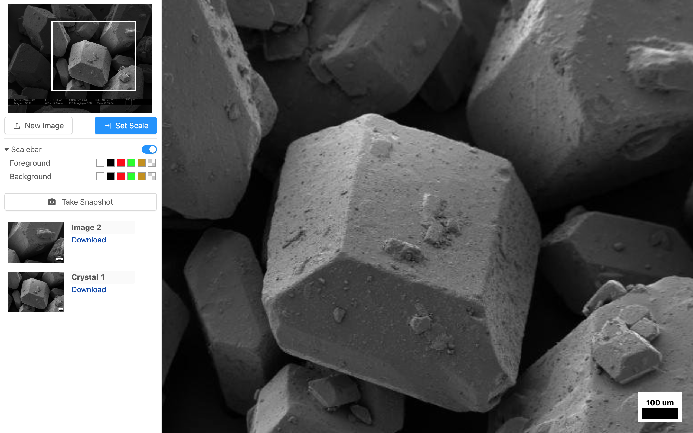

 

  

# Micro Measure
A React app that allows users to upload a digital micrograph with a scalebar,and overlays its own scalebar that sizes dynamically on zoom.

## Features
* Scroll to zoom on image
* Click and drag to move image
* After setting the scale bar (click the end points), a new scale bar is overlayed that scales dynamically on zoom
* Save and download snapshots 

## Deployed Site
[https://www.micromeasure.app](https://www.micromeasure.app)

